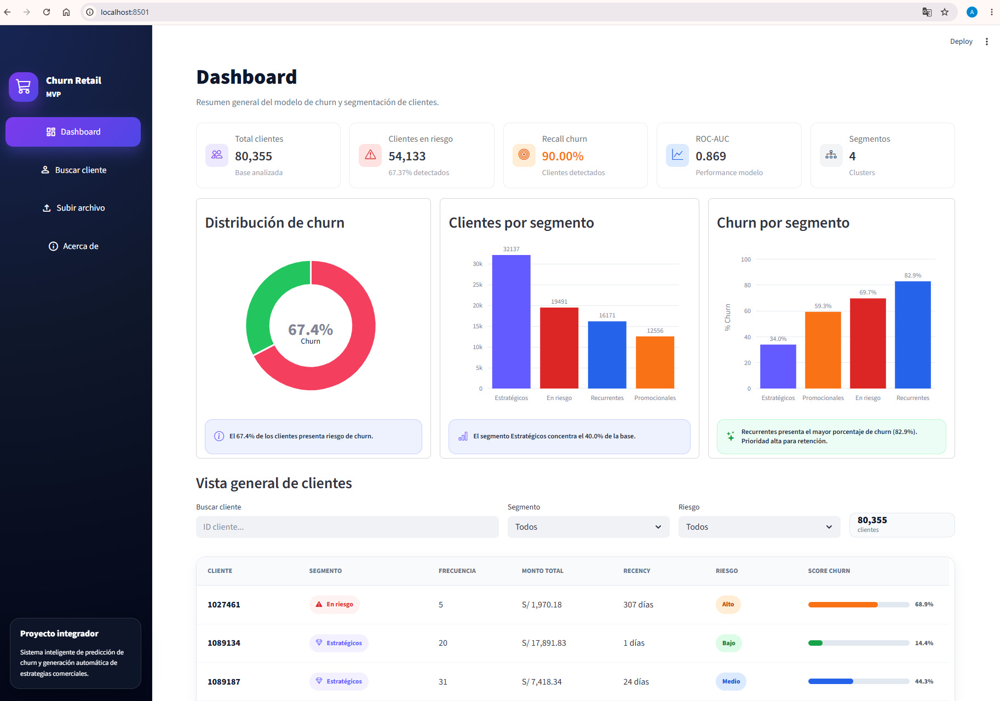
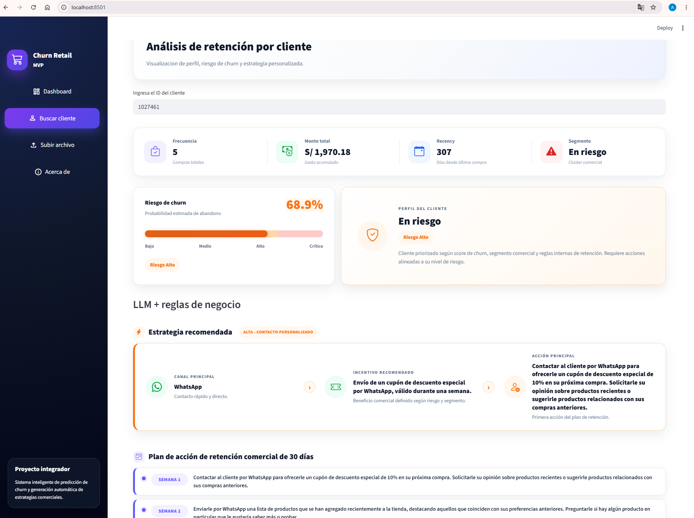
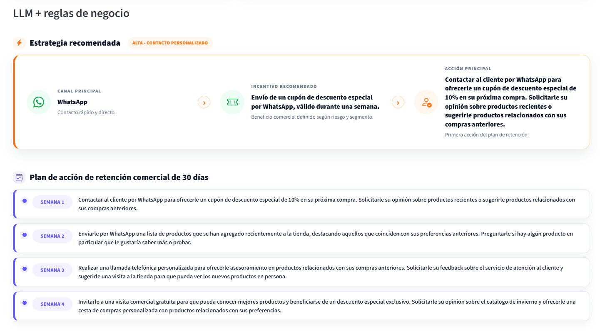
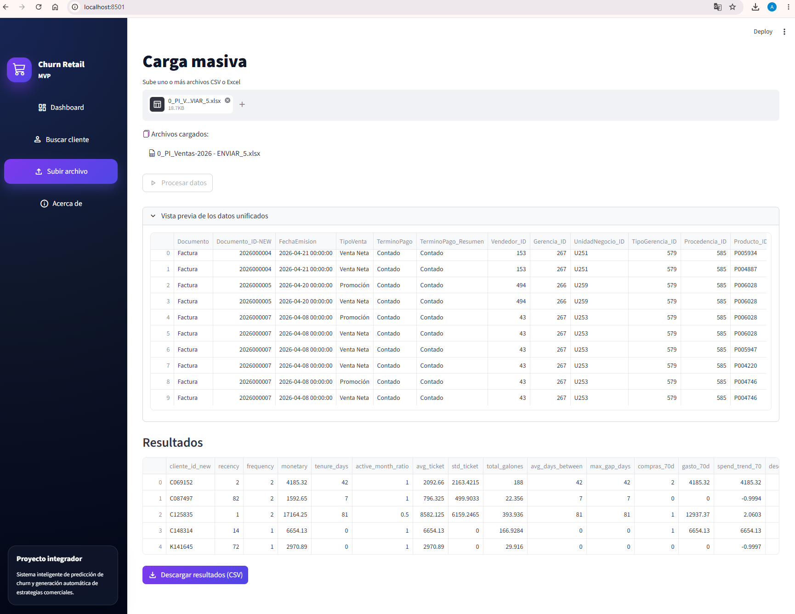
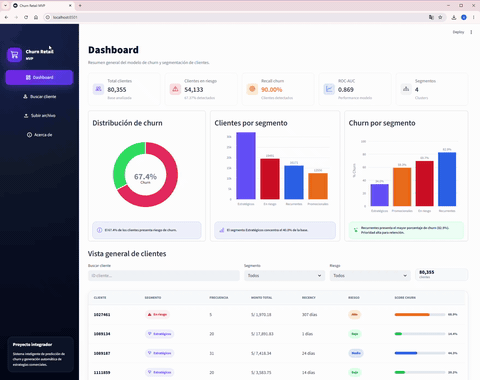

# 🛒 Churn Retail MVP

Sistema inteligente de predicción de churn y generación automática de estrategias comerciales mediante **Machine Learning**, **Clustering** e **IA Generativa**.

Este proyecto fue desarrollado como MVP académico-profesional para el curso de Proyecto Integrador de la **Maestría en Data Science** de la Universidad Nacional de Ingeniería.

---

# 🚀 Demo del proyecto

El sistema permite:

- 📉 Predecir clientes con riesgo de abandono (churn)
- 🧠 Segmentar automáticamente clientes mediante clustering
- 🤖 Generar estrategias comerciales personalizadas usando LLMs
- 📊 Visualizar KPIs y métricas en un dashboard ejecutivo
- 📂 Procesar archivos masivos CSV y Excel
- ⚡ Ejecutar un pipeline completo de analítica en Streamlit

---

# 🧠 Tecnologías utilizadas

## Machine Learning

- XGBoost
- Scikit-learn
- KMeans Clustering

## IA Generativa

- Gemini API
- Hugging Face Inference API
- Mistral 7B Instruct

## Data & Backend

- Python
- Pandas
- NumPy

## Frontend

- Streamlit
- Plotly
- CSS Custom UI

---

# 📊 Características principales

## 🔹 Predicción de churn

Modelo supervisado XGBoost para identificar clientes con alta probabilidad de abandono.

### Métricas principales

| Modelo       | Métrica        |
| ------------ | -------------- |
| XGBoost      | ROC-AUC: 0.869 |
| Recall churn | 90%            |

---

## 🔹 Segmentación automática

Segmentación comercial mediante KMeans en 4 perfiles:

- Estratégicos
- Recurrentes
- Promocionales
- En riesgo

---

## 🔹 IA Generativa aplicada

El sistema genera automáticamente:

- análisis comercial
- prioridad de atención
- canal sugerido
- incentivo recomendado
- plan de retención

usando reglas de negocio + modelos LLM.

---

# 🏗️ Arquitectura del proyecto

```text
MDS_PI/
│
├── app/
│   └── streamlit_app.py
│
├── data/
│   ├── raw/
│   └── processed/
│       ├── clientes_churn.csv
│       ├── clientes_churn_scored.csv
│       ├── clientes_churn_final.csv
│       └── estrategias_clientes.csv
│
├── notebooks/
│   ├── 01_eda_datasets.ipynb
│   ├── 02_data_preparation_churn.ipynb
│   ├── 03_modeling_churn.ipynb
│   ├── 04_clustering_segmentation.ipynb
│   └── 05_llm_recommendations.ipynb
│
├── src/
│   ├── llm/
│   │   └── strategy.py
│   │
│   ├── models/
│   │   ├── xgb_model.pkl
│   │   ├── threshold.pkl
│   │   ├── scaler_cluster.pkl
│   │   └── kmeans.pkl
│   │
│   ├── pipeline/
│   │   ├── preprocess.py
│   │   ├── predict.py
│   │   ├── segment.py
│   │   └── save.py
│   │
│   └── ui/
│       └── helpers.py
│
├── styles/
│   └── styles.css
│
├── requirements.txt
├── .env
└── README.md
```

---

# ⚙️ Pipeline del sistema

El sistema sigue una arquitectura modular orientada a analítica avanzada, predicción de churn y automatización comercial mediante IA Generativa.

---

## 1️⃣ Ingesta de datos

### Objetivo

Centralizar y consolidar información transaccional y comercial proveniente de múltiples fuentes.

### Archivos utilizados

- Ventas 2022–2023
- Ventas 2024–2025
- Información de clientes
- Información de deuda

### Proceso realizado

- Lectura de archivos Excel
- Unificación de datasets
- Validación de tipos de datos
- Estandarización de columnas
- Limpieza de registros inconsistentes

### Resultado

Dataset consolidado para análisis y modelamiento.

---

## 2️⃣ Preprocesamiento y Feature Engineering

### Objetivo

Transformar datos transaccionales en variables predictivas orientadas al comportamiento del cliente.

### Variables construidas

#### 🔹 Recency

Cantidad de días desde la última compra.

#### 🔹 Frequency

Número de transacciones realizadas por cliente.

#### 🔹 Monetary

Monto total gastado por cliente.

#### 🔹 Avg Ticket

Promedio de gasto por transacción.

#### 🔹 Tenure

Tiempo de permanencia del cliente.

#### 🔹 Variables comerciales

- tipo de producto
- unidad de negocio
- procedencia
- tipo de gerencia

#### 🔹 Variables crediticias

- deuda total
- comportamiento financiero

### Proceso realizado

- Agrupaciones por cliente
- Cálculo de métricas RFM
- Tratamiento de valores nulos
- Escalamiento de variables
- Encoding de variables categóricas

### Resultado

Dataset analítico preparado para Machine Learning.

---

## 3️⃣ Construcción de variable objetivo (Churn)

### Objetivo

Definir qué clientes presentan riesgo de abandono.

### Metodología utilizada

Se utilizó la variable **Recency** como aproximación de abandono comercial:

```python
churn = 1 si recency > umbral
```

### Justificación

En retail, un cliente que deja de comprar durante un periodo prolongado presenta alta probabilidad de abandono.

### Resultado

Variable binaria:

- `0` → Cliente activo
- `1` → Cliente con riesgo de churn

---

## 4️⃣ Modelamiento predictivo

### Objetivo

Predecir clientes con alta probabilidad de abandono.

### Modelos evaluados

#### 🔹 Logistic Regression

Modelo baseline interpretable.

#### 🔹 XGBoost

Modelo de boosting optimizado para clasificación.

### Variables utilizadas

- Recency
- Frequency
- Monetary
- Avg Ticket
- Variables comerciales
- Variables crediticias

### Métricas evaluadas

- ROC-AUC
- Recall
- Accuracy
- Precision

### Resultado obtenido

| Modelo              | ROC-AUC |
| ------------------- | ------- |
| Logistic Regression | 0.780   |
| XGBoost             | 0.869   |

### Modelo seleccionado

✅ XGBoost

Debido a su mejor capacidad predictiva y mejor desempeño general.

---

## 5️⃣ Scoring de clientes

### Objetivo

Asignar un score de riesgo individual a cada cliente.

### Proceso realizado

El modelo genera:

- Probabilidad de churn
- Clasificación final
- Nivel de riesgo

### Variables generadas

- `score_churn`
- `pred_churn`
- `nivel_riesgo`

### Resultado

Base de clientes priorizada comercialmente.

---

## 6️⃣ Segmentación de clientes

### Objetivo

Agrupar clientes con comportamientos similares para personalizar estrategias comerciales.

### Técnica utilizada

#### 🔹 KMeans Clustering

### Variables utilizadas

- Frecuencia
- Monto total
- Recency
- Score churn

### Segmentos obtenidos

| Segmento      | Descripción                   |
| ------------- | ----------------------------- |
| Estratégicos  | Alto valor y alta actividad   |
| Recurrentes   | Compra frecuente              |
| Promocionales | Sensibles a descuentos        |
| En riesgo     | Alta probabilidad de abandono |

### Resultado

Segmentación automática para campañas de retención.

---

## 7️⃣ Generación de estrategias con IA Generativa

### Objetivo

Automatizar recomendaciones comerciales personalizadas.

### Tecnologías utilizadas

- Gemini API
- Hugging Face
- Mistral 7B Instruct

### Proceso realizado

El sistema construye prompts dinámicos utilizando:

- Segmento del cliente
- Riesgo de churn
- Variables comerciales
- Historial transaccional

### Ejemplo de prompt

```python
Eres un experto en retención de clientes retail.

Cliente:
- Segmento: Estratégico
- Riesgo: Alto
- Recency: 120 días
- Frecuencia: 3 compras

Genera:
1. Diagnóstico
2. Nivel de prioridad
3. Estrategias comerciales
```

### Resultado generado

- diagnóstico automático
- prioridad comercial
- incentivo recomendado
- canal sugerido
- acciones de retención

---

## 8️⃣ Dashboard interactivo

### Objetivo

Visualizar métricas y resultados del sistema de manera ejecutiva.

### Funcionalidades

- KPIs de churn
- Riesgo por segmento
- Distribución de clientes
- Consulta individual
- Upload masivo
- Generación automática de estrategias

### Tecnología utilizada

- Streamlit
- Plotly
- CSS personalizado

### Resultado

MVP funcional orientado a toma de decisiones comerciales.

---

## 9️⃣ Persistencia de resultados

### Objetivo

Guardar resultados procesados para reutilización y análisis posterior.

### Archivos generados

- `clientes_churn.csv`
- `clientes_churn_scored.csv`
- `clientes_churn_final.csv`
- `estrategias_clientes.csv`

### Resultado

Pipeline reutilizable y escalable.

---

# 🎨 Interfaz del sistema

El dashboard incluye:

- KPIs ejecutivos
- Distribución de churn
- Riesgo por segmento
- Tabla interactiva de clientes
- Búsqueda individual
- Estrategias automáticas
- Upload masivo

---

# 📸 Capturas del sistema

## Dashboard ejecutivo



## Búsqueda de clientes



## Estrategia generada con IA



## Carga masiva de archivos



---

# 🎥 Demo del sistema



# 🧩 Modelos utilizados

| Componente       | Tecnología            |
| ---------------- | --------------------- |
| Predicción churn | XGBoost               |
| Segmentación     | KMeans                |
| Estrategias IA   | Gemini + Hugging Face |
| Dashboard        | Streamlit             |
| Visualización    | Plotly                |

---

# 🔐 Variables de entorno

Crear un archivo `.env`

```env
HF_TOKEN=tu_token_huggingface
GEMINI_API_KEY=tu_api_key_gemini
```

---

# ▶️ Instalación

## 1️⃣ Clonar repositorio

```bash
git clone https://github.com/tu_usuario/tu_repo.git
cd tu_repo
```

---

## 2️⃣ Crear entorno virtual

### Windows

```bash
python -m venv venv
venv\Scripts\activate
```

### Linux / Mac

```bash
python3 -m venv venv
source venv/bin/activate
```

---

## 3️⃣ Instalar dependencias

```bash
pip install -r requirements.txt
```

---

## 4️⃣ Ejecutar aplicación

```bash
streamlit run app/streamlit_app.py
```

---

# 📂 Dataset

El proyecto fue desarrollado utilizando:

- +4 millones de transacciones
- Periodo 2022–2025
- 80,355 clientes únicos

Los datos originales no se publican por confidencialidad.

---

# 📈 Resultados obtenidos

| Métrica             | Resultado |
| ------------------- | --------- |
| ROC-AUC             | 0.869     |
| Recall churn        | 90%       |
| Clientes analizados | 80,355    |
| Segmentos generados | 4         |

---

# 🧠 Estrategias generadas por IA

Ejemplo de salida:

```json
{
  "analisis_breve": "Cliente estratégico con disminución reciente de actividad comercial.",
  "prioridad": "Alta - Contacto personalizado",
  "canal_sugerido": "WhatsApp",
  "incentivo_recomendado": "Descuento exclusivo del 15%",
  "estrategias": {
    "accion_1": "Enviar contacto personalizado con oferta preferencial.",
    "accion_2": "Ofrecer beneficios por recompra.",
    "accion_3": "Realizar seguimiento comercial.",
    "accion_4": "Invitar a programa de fidelización."
  }
}
```

---

# 📌 Características destacadas

✅ Arquitectura modular  
✅ Pipeline completo de ML  
✅ Integración de IA Generativa  
✅ Dashboard profesional  
✅ Diseño UI custom  
✅ Feature engineering avanzado  
✅ Persistencia de estrategias  
✅ Procesamiento masivo

---

# 👥 Equipo

- Amalia Anto Alzamora
- Leticia Verano Custodio

---

# 🎓 Contexto académico

Proyecto desarrollado para:

**Maestría en Data Science**  
Universidad Nacional de Ingeniería (UNI)

---

# 📄 Licencia

Proyecto desarrollado con fines académicos y demostrativos.

---

# ⭐ Autor

Desarrollado como MVP de analítica avanzada para predicción de churn y automatización comercial con IA.
